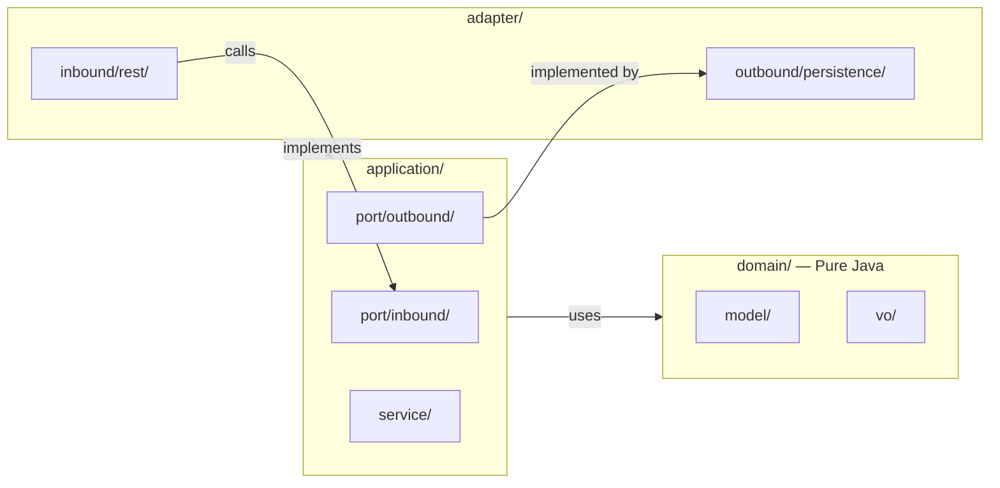

<div align="center">
  <br/>
  
  
  
  
  <br/><br/>
</div>

<div align="center">
  <h1>
    <span style="color:#0891b2;">⬡</span> hexboot
  </h1>
  <p style="font-size:1.2em;color:#a1a1aa;max-width:600px;">
    <strong>Spring Boot</strong> microservices with <strong>Hexagonal Architecture</strong><br/>
    (Ports &amp; Adapters) — generated, modified, audited &amp; migrated by AI agents.
  </p>
  <br/>
  <table align="center">
    <tr>
      <td align="center"><a href="#-create"><kbd>🆕 CREATE</kbd></a></td>
      <td align="center"><a href="#-modify"><kbd>✏️ MODIFY</kbd></a></td>
      <td align="center"><a href="#-audit"><kbd>🔍 AUDIT</kbd></a></td>
      <td align="center"><a href="#-migrate"><kbd>🔄 MIGRATE</kbd></a></td>
    </tr>
  </table>
  <br/>
</div>

---

## 📦 What is hexboot?

**hexboot** is an AI Agent Skill that creates, modifies, audits, and migrates production-ready Spring Boot 3.x microservices following **Hexagonal Architecture** (Ports & Adapters). It works with **Claude Code**, **Cursor**, **Windsurf**, and **OpenCode**.

No scaffolding CLI. No plugins. Just natural language → clean architecture.

---

## ✨ Features

<table>
  <tr>
    <td width="50%">
      <h4>🧱 Pure Domain</h4>
      <p>Zero framework imports in <code>domain/</code>. Business logic stays clean, testable, and framework-independent.</p>
    </td>
    <td width="50%">
      <h4>🔌 Ports & Adapters</h4>
      <p>Inbound/outbound ports define contracts. Adapters implement them. Swap databases, add messaging, change REST → GraphQL — without touching business logic.</p>
    </td>
  </tr>
  <tr>
    <td width="50%">
      <h4>🛡️ Security-aware</h4>
      <p>JWT, OAuth2, Basic Auth — <code>@PreAuthorize</code> on inbound ports only. <code>@Transactional</code> on use cases only.</p>
    </td>
    <td width="50%">
      <h4>🐳 Docker-ready</h4>
      <p>Multi-stage <code>Dockerfile</code> and <code>docker-compose.yml</code> generated on demand.</p>
    </td>
  </tr>
  <tr>
    <td width="50%">
      <h4>📋 OpenAPI</h4>
      <p>Auto-generated <code>/swagger-ui.html</code> and <code>/api-docs</code> when selected.</p>
    </td>
    <td width="50%">
      <h4>🧪 Test coverage</h4>
      <p>JUnit 5 + Mockito + AssertJ for unit and/or integration tests with Testcontainers.</p>
    </td>
  </tr>
</table>

---

## 🚀 Quick Start

### 1. Install

<details>
<summary><strong>Cursor</strong> — add to <code>.cursor/rules/</code></summary>

Copy the file into your project:

```bash
curl -O https://raw.githubusercontent.com/your/hexboot/main/hexboot/.cursor/rules/hexboot.mdc
# Place it at .cursor/rules/hexboot.mdc
```
</details>

<details>
<summary><strong>Windsurf</strong> — add to <code>.windsurfrules</code></summary>

Append the contents of `.windsurfrules` to your project's `.windsurfrules` file.
</details>

<details>
<summary><strong>Claude Code</strong> — add to <code>CLAUDE.md</code></summary>

Include the contents of `SKILL.md` at the end of your project's `CLAUDE.md` or `instructions.md`.
</details>

<details>
<summary><strong>OpenCode</strong> — add to <code>.opencode/</code></summary>

Place the skill in your skills directory and reference it from your opencode configuration.
</details>

### 2. Use

Tell your AI agent what you want:

> *"Create a Spring Boot microservice for a blog with Postgres, JWT auth, Docker, and OpenAPI"*

The agent will ask you a few questions (base package, Java version, etc.) and scaffold the entire project with hexagonal architecture.

---

## 🔧 Workflows

### 🆕 CREATE

Scaffold a new project from scratch. The agent asks:

- Base package & service name
- Java version (17 / 21 / 23)
- Database (Postgres / MySQL / H2 / MongoDB / none)
- Security (JWT / OAuth2 / Basic / none)
- Docker, API docs, messaging, tests

Then generates the full structure: domain models, value objects, use cases, ports, REST controllers, JPA adapters, tests, Dockerfile — all respecting hexagonal rules.

### ✏️ MODIFY

Add new features to an existing hexboot project:

> *"Add an Order entity with CRUD endpoints and Postgres persistence"*

The agent reads the existing code, understands the conventions, and generates all required files across every layer — domain → application → adapter.

### 🔍 AUDIT

Review an existing project for hexagonal compliance:

- Domain purity (zero framework imports)
- Dependency direction (domain ← application ← adapters)
- Naming conventions
- Security placement (`@PreAuthorize` on ports, `@Transactional` on use cases)
- Overall architectural health

Returns a checklist with ✅ / ❌ for each rule.

### 🔄 MIGRATE

Transform a traditional layered Spring Boot project into Hexagonal Architecture:

- Extracts domain logic from services
- Creates port interfaces
- Separates JPA entities from domain models
- Restructures package layout
- Preserves existing behavior

---

## 🏛️ Architecture Rules (Non-Negotiable)



| Layer | Depends On | Framework Allowed |
|-------|-----------|------------------|
| `domain/` | nothing | **No** |
| `application/` | domain only | **No** |
| `adapter/inbound/` | application + domain | **Yes** |
| `adapter/outbound/` | application + domain | **Yes** |
| `shared/` | anything | **Yes** |

---

## 📁 Project Structure

```
{serviceName}/
├── pom.xml
├── Dockerfile                          (if Docker=yes)
├── docker-compose.yml                  (if Docker=yes)
└── src/
    ├── main/java/{basePackage}/
    │   ├── {Service}Application.java
    │   ├── domain/
    │   │   ├── model/                  Business entities
    │   │   ├── vo/                     Value objects
    │   │   └── event/                  Domain events
    │   ├── application/
    │   │   ├── port/inbound/           Use case interfaces
    │   │   ├── port/outbound/          Repository/publisher interfaces
    │   │   └── service/                Use case implementations
    │   ├── adapter/
    │   │   ├── inbound/
    │   │   │   ├── rest/               Controllers, DTOs, mappers
    │   │   │   └── security/           Security config
    │   │   └── outbound/
    │   │       └── persistence/        JPA entities, mappers, adapters
    │   └── shared/
    │       ├── dto/                    ApiResponse
    │       ├── exception/              GlobalExceptionHandler
    │       └── config/                 App config
    └── test/java/{basePackage}/
```

---

## 📚 References

| File | Content |
|------|---------|
| [`references/project-scaffold`](references/project-scaffold) | pom.xml template, directory setup |
| [`references/domain-patterns`](references/domain-patterns) | Domain model & VO patterns |
| [`references/ports-usecases`](references/ports-usecases) | Port & use case examples |
| [`references/adapters`](references/adapters) | REST, JPA, messaging adapters |
| [`references/security`](references/security) | JWT, OAuth2, Basic auth |
| [`references/production-essentials`](references/production-essentials) | Logging, metrics, error handling |
| [`references/migration-guide`](references/migration-guide) | Layered → Hexagonal migration steps |
| [`references/audit-checklist`](references/audit-checklist) | Architecture review checklist |

---

## 🧪 Demo

Visit the [hexboot demo site](https://your-username.github.io/hexboot) for an interactive architecture demo with real-time audit checks.

---

<div align="center">
  <br/>
  <p style="color:#a1a1aa;font-size:.875rem;">
    Built with <span style="color:#ef4444;">♥</span> for developers who believe architecture matters.
  </p>
  <p style="color:#52525b;font-size:.75rem;">
    MIT License · 2025 · hexboot
  </p>
</div>
